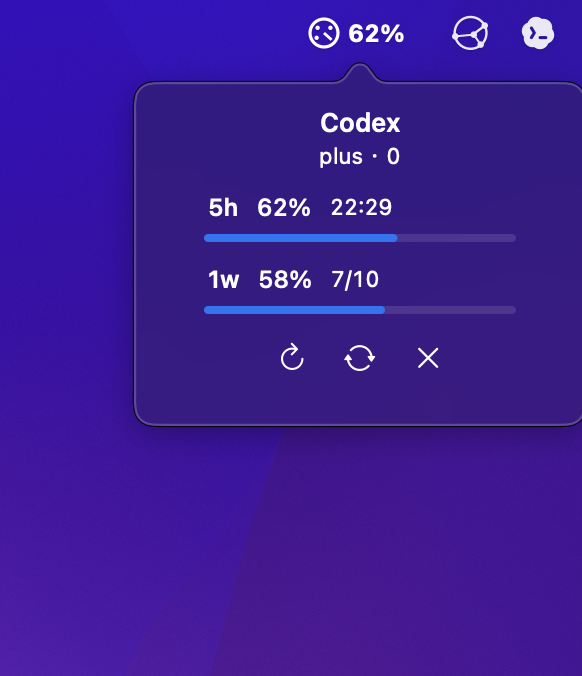

# Codex Usage Float

English | [中文](#中文)

## English

Codex Usage Float is a tiny macOS menu bar utility that shows your current Codex usage limits without opening the account menu.

It reads the local Codex app-server method `account/rateLimits/read`, then displays the short-window and weekly-window remaining percentages with reset times. The widget refreshes every 60 seconds and does not send prompts to the model, so it does not consume model tokens.



### Features

- Always-visible macOS menu bar usage badge
- White rendered badge for strong visibility on colorful menu bar backgrounds
- Hover-to-refresh translucent popover with Apple-style glassmorphism
- Stable centered popover layout that avoids jumping while refreshing
- Icon-only popover controls for refresh, restart, and quit, with hover tooltips
- Shows remaining usage for the primary and secondary Codex limit windows
- Shows reset time for each window
- Auto-refreshes every 60 seconds without consuming model tokens
- Optional auto-start and auto-close with Codex
- Source-only Swift/AppKit implementation

### Requirements

- macOS 13 or later
- Codex desktop app installed at `/Applications/Codex.app`
- Swift command line tools, usually included with Xcode Command Line Tools

### Build

```bash
./build.sh
```

This creates:

```text
CodexUsageFloat.app
```

### Run

```bash
./Launch\ Codex\ Usage\ Float.command
```

If macOS blocks the command file, right-click it and choose **Open**.

### Auto-Start With Codex

```bash
./install-autostart.sh
```

This installs a user LaunchAgent. It watches for the Codex app every 10 seconds:

- when Codex is running, the widget starts
- when Codex quits, the widget closes

You can also double-click `Install Auto-Start.command` in Finder.

### Remove Auto-Start

```bash
./uninstall-autostart.sh
```

### Notes

- The widget reads account usage metadata only.
- It does not call a model and does not consume prompt/completion tokens.
- The bundled `.app` is generated locally by `build.sh`; build output is intentionally ignored by Git.

---

## 中文

Codex Usage Float 是一个很小的 macOS 状态栏组件，用来快速查看 Codex 当前套餐/用量剩余情况，不用每次点开账户菜单。

它读取 Codex 本地 app-server 的 `account/rateLimits/read` 方法，然后显示短周期窗口和周窗口的剩余百分比与重置时间。浮窗每 60 秒刷新一次，不会向模型发送 prompt，所以不会消耗模型 token。


### 功能

- macOS 状态栏常驻用量徽标
- 白色渲染徽标，在彩色菜单栏背景上更容易看清
- 鼠标移上去自动刷新，并显示接近苹果毛玻璃风格的半透明弹窗
- 固定居中的弹窗布局，刷新时不易跳动
- 弹窗底部提供仅图标按钮：刷新、重启、退出，鼠标悬停显示说明
- 显示 Codex 两个用量窗口的剩余百分比
- 显示每个窗口的重置时间
- 每 60 秒自动刷新，不消耗模型 token
- 可选：随 Codex 打开自动启动，随 Codex 退出自动关闭
- 使用 Swift/AppKit 编写，无额外前端框架

### 环境要求

- macOS 13 或更新版本
- Codex 桌面版安装在 `/Applications/Codex.app`
- Swift 命令行工具，通常随 Xcode Command Line Tools 安装

### 构建

```bash
./build.sh
```

构建后会生成：

```text
CodexUsageFloat.app
```

### 运行

```bash
./Launch\ Codex\ Usage\ Float.command
```

如果 macOS 阻止运行，可以右键这个 `.command` 文件，然后选择**打开**。

### 跟随 Codex 自动启动

```bash
./install-autostart.sh
```

这个脚本会安装一个用户级 LaunchAgent，每 10 秒检查一次 Codex 是否正在运行：

- Codex 运行时，自动启动浮窗
- Codex 退出时，自动关闭浮窗

也可以在 Finder 里双击 `Install Auto-Start.command` 来安装。

### 取消自动启动

```bash
./uninstall-autostart.sh
```

### 说明

- 浮窗只读取账户用量元数据。
- 它不会调用模型，也不会消耗 prompt/completion token。
- `.app` 是通过 `build.sh` 在本地生成的构建产物，不建议提交到 Git。
